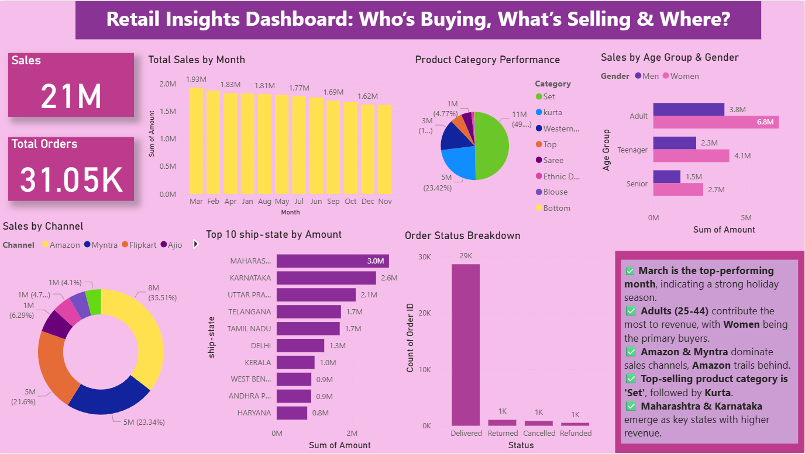

# 📊 E-Commerce Insights Dashboard

## 📝 Project Overview

This Power BI dashboard provides a detailed analysis of an e-commerce dataset, offering insights into customer behavior, sales performance, product trends, and geographical distribution of revenue. The dashboard is designed for business stakeholders to make data-driven decisions regarding marketing, inventory, and customer engagement.

---

## 🧰 Tools Used

- ⚙️ **Power BI** – for interactive data visualization
- 📂 **Excel (.xlsx)** – data source
- 🧠 **Data Storytelling Principles** – for insight-driven reporting

---

## 📌 Key Visuals & Insights

| 🔍 Visual                         | 📈 Chart Type              | 📊 Key Insight |
|----------------------------------|----------------------------|----------------|
| Total Sales by Month             | Column Chart               | Seasonal sales trends and peak months |
| Sales by Age Group & Gender      | Stacked Bar Chart          | Demographic distribution of revenue |
| Sales by Channel                 | Donut Chart                | Performance of platforms (Myntra, Ajio, etc.) |
| Sales by State                   | Stacked Bar Chart          | High-revenue states for regional marketing |
| Product Category Performance     | Pie Chart                  | Top-performing product categories |
| Order Status Breakdown           | Clustered Column Chart     | Order fulfillment status overview |

---

## 💡 Business Insights

✅ **March** is the top-performing month – ideal for targeted holiday campaigns.  
✅ **Adults (25-44)** and **Women** are the largest customer segments.  
✅ **Amazon** leads among sales channels, followed by **Myntra**.  
✅ **Sets and Kurtas** are the top-selling product categories.  
✅ **Maharashtra and Karnataka** show highest revenue potential.  

---

## 📸 Dashboard Preview

  

---
